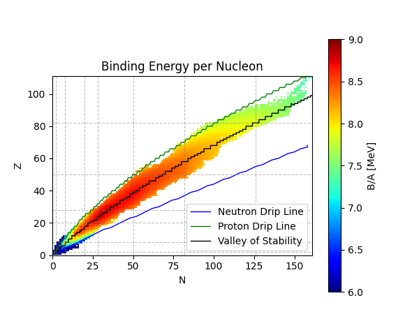

# Nuclear Physics - Ground-state properties
### Nuclear masses and spins analysis

Practical part for the 2nd block of the course <a href="https://is.cuni.cz/studium/predmety/index.php?do=predmet&kod=NJSF064">Nuclear Physics (NJSF064)</a>, given in the winter term at the Institute of Particle and Nuclear Physics, Faculty of Mathematics and Physics, Charles University, Prague, Czech Republic.

Topics covered in the code:
<ul>
    <li>
        Binding energy per nucleon
    </li>
    <li>
        Separation energies (neutron, proton, two-neutron, two-proton)
    </li>
    <li>
        &alpha; and &beta; stability
    </li>
    <li>
        Bethe-Weizsäcker formula, fit of its parameters
    </li>
    <li>
        Balley of stability, neutron and proton drip lines, &beta; stability line
    </li>
    <li>
        Ground-state spins and parities
    </li>
</ul>

<a href="https://ipnp.cz/~knapp/Nuclear_physics.htm">Additional information about the subject</a>.

<a href="https://pavelstransky.cz/teaching/NJSF064_Block_2.pdf">Direct link to the lecture notes</a> related to this practical programming part.

The data attached are a copy of AME2020 and NUBASE4 tables available at the <a href="https://www-nds.iaea.org/amdc/">dedicated IAEA web page</a>.