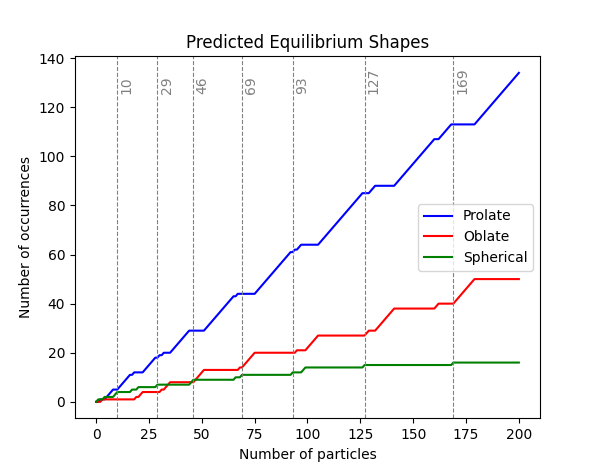

# Nuclear Physics - Ground-state properties
Practical part for the 2nd block of the course <a href="https://is.cuni.cz/studium/predmety/index.php?do=predmet&kod=NJSF064">Nuclear Physics (NJSF064)</a>, given in the winter term at the Institute of Particle and Nuclear Physics, Faculty of Mathematics and Physics, Charles University, Prague, Czech Republic.

<a href="https://ipnp.cz/~knapp/Nuclear_physics.htm">Additional information about the subject</a>.

<a href="https://pavelstransky.cz/teaching/NJSF064_Block_2.pdf">Direct link to the lecture notes</a> related to this practical programming part.

### Nuclear masses and spins analysis

Topics covered in the code <a href="analyse_ame.py">analyse_ame.py</a>:
<ul>
    <li>
        Binding energy per nucleon
    </li>
    <li>
        Separation energies (neutron, proton, two-neutron, two-proton)
    </li>
    <li>
        &alpha; and &beta; stability
    </li>
    <li>
        Bethe-Weizsäcker formula, fit of its parameters
    </li>
    <li>
        Valley of stability, neutron and proton drip lines, &beta; stability line
    </li>
    <li>
        Ground-state spins and parities
    </li>
</ul>

The data attached are a copy of AME2020 and NUBASE4 tables available at the <a href="https://www-nds.iaea.org/amdc/">dedicated IAEA web page</a>.

### Schematic single-particle approach to stable nuclear deformation
The main file to run the analysis is <a href="analyse_shape.py">analyse_shape.py</a>.
In the preamble with packages, select one of the model you want to use:
<ul>
    <li>
        Nilsson model diagonalised in the Cartesian coordinates: <a href="nilsson_cartesian.py">nilsson_cartesian.py</a>
    </li>
    <li>
        Spheroid infinte-size potential well: <a href="spheroid.py">spheroid.py</a> [<a href="https://link.aps.org/doi/10.1103/PhysRevC.79.034317">I. Hamamoto, B.R. Mottelson, Phys. Rev. C 79, 034317 (2009)</a>]
    </li>
    <li>
        Nilsson model diagonalised in the spherical coordinates with l^2 term: <a href="nilsson_cartesian.py">nilsson_spherical.py</a>
    </li>
</ul>

When run for the first time, the code precalculates the spectrum. 
Note that it can take some time (in case of Nilsson in the spherical coordinates up to several hours).
The spectrum is then saved and used when the code is subsequently run.

Topics covered in the code:
<ul>
    <li>
        Spectrum depending on the deformation &delta; (Nilsson diagram).
    </li>
    <li>
        One-particle separation energy (to determine the shells).
    </li>
    <li>
        Cummulative number of equilibrium shapes.
    </li>
    <li>
        Equilibrium deformation.
    </li>
</ul>

